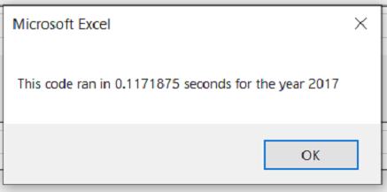
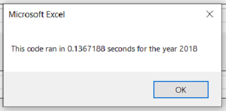

# VBA of Wall Street
## Overview
### Purpose 
The purpose of this analysis is to assist Steve in making the macro to analyze stocks run faster. Instead of searching through several dozen stocks to find which ones performed the best, he wants to search through the entire stock market which consists of  thousands of stocks. This will take much longer, and he wants to optimize his code as much as possible in order to save time.

## Results
### 2017 Stock Analysis
*In this analysis,  seconds have been rounded to the nearest hundredth.*

When the original code was run on 2017 stocks, it took 0.97 seconds. The refactored code took 0.12 seconds:

  

### 2018 Stock Analysis
When the original code was run on 2018, it took 0.95 seconds. The refactored code took  0.14 seconds.

  

The refactored code saved about 0.8 seconds in both cases. If we extrapolate that for thousands of stocks, this may equate to saving several hours spent waiting for the macro to run.

## Summary
### Advantages and Disadvantages of Refactoring Code
The advantages of refactoring code can be:
* Code can be made more straight-forward, less complex, and easier to maintain in the long run.
* Code can be optimized, making it run faster.

The disadvantages of refactoring code can be:
* Work can be time-consuming and not worth the time and money.
* There is a chance for mistakes. Code may need to be re-tested and this will take time and money.

In this project, and index was used to make things run faster. We did not add much complexity and I believe it will be just as easy to maintain the long run. We know the results of the refactored code matched exactly to that of the original code in a small dataset, so we have confidence that the results will match in a large dataset. We did not spend too much time refactoring the code and it was time well spent.

